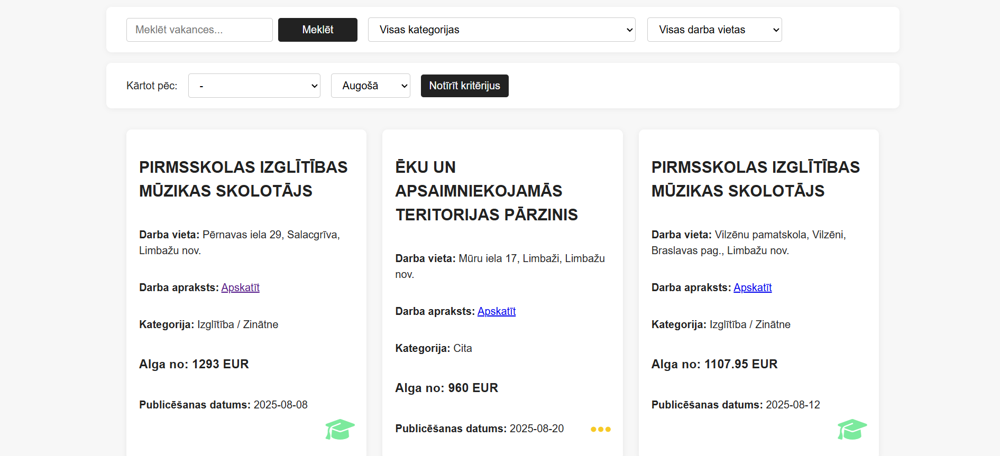
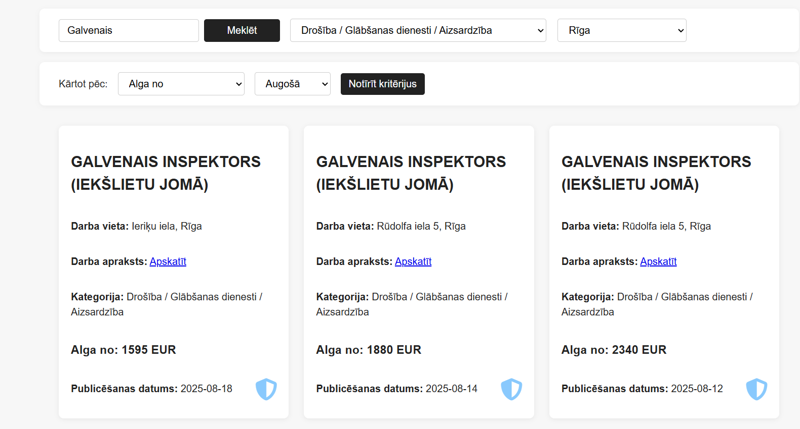

# Nika Vakances

**Nika Vakances** ir vienkārša darba sludinājumu pārlūkošanas tīmekļa lietotne, kas izmanto Latvijas Nodarbinātības valsts aģentūras (NVA) atvērto datu API.

## Funkcionalitāte

- Vakances meklēšana pēc atslēgvārda
- Filtrēšana pēc kategorijas un darba vietas
- Kārtošana pēc alfabēta, algas vai publicēšanas datuma
- Lapu šķirošana (paginācija)
- Responsīvs dizains (ērti lietojams arī uz telefona un planšetdatora)

## Izskats

### Logo un moto


### Lietotāja POV



## Lietošana

1. Klonē šo repozitoriju:
    ```
    git clone https://github.com/tavs-lietotajvards/darbumekletajs.git
    ```
2. Atver `index.html` jebkurā pārlūkprogrammā.

## Fails struktūra

- `index.html` – galvenā HTML lapa
- `style.css` – stilu lapa 
- `script.js` – galvenais JavaScript (datu ielāde, filtrēšana, kārtošana)
- `README.md` – šī pamācība

## Datu avots

Vakances tiek ielādētas no Latvijas atvērto datu portāla API:  
https://data.gov.lv/dati/eng/dataset/vakances

## Autors

Nika Vakances  
2025

---

**Piezīme:**  
Šis projekts ir izglītojošs piemērs un negarantē darba atrašanu!